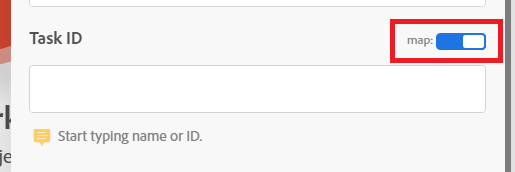

# 创建基本场景

Adobe Workfront Fusion的职责是自动化您的流程，以使您能够专注于新任务，而不是一遍又一遍地重复相同的任务。 它的工作方式是，关联应用程序和服务内外的操作，从而创建一个自动传输和转换数据的方案。 您创建的方案会监视应用程序或服务中的数据，并对这些数据进行处理以提供您想要的结果。

此示例引导您完成以下过程：创建在Workfront中搜索请求并将其转换为项目的方案。

## 访问要求

+++ 展开以查看本文中各项功能的访问要求。

<table style="table-layout:auto">
 <col> 
 <col> 
 <tbody> 
  <tr> 
   <td role="rowheader">Adobe Workfront包</td> 
   <td> 
任何Adobe Workfront Workflow包和任何Adobe Workfront自动化和集成包

Workfront Ultimate

Workfront Prime和Select包，以及额外购买的Workfront Fusion。
 </td> 
  </tr> 
  <tr data-mc-conditions=""> 
   <td role="rowheader">Adobe Workfront许可证</td> 
   <td> 
标准

工作或更高
 </td> 
  </tr> 
  <tr> 
   <td role="rowheader">产品</td> 
   <td>
   
如果贵组织具有不包含Workfront Automation and Integration的Select或Prime Workfront包，则贵组织必须购买Adobe Workfront Fusion。</li></ul>
   </td> 
  </tr>
 </tbody> 
</table>

有关此表中信息的更多详细信息，请参阅文档[中的](/help/workfront-fusion/references/licenses-and-roles/access-level-requirements-in-documentation.md)访问要求。

+++

## 创建实践场景

### 开始创建方案

1. 在&#x200B;**方案**&#x200B;区域中，单击&#x200B;**创建新方案**。

   要找到“场景”区域，请参阅[导航Workfront Fusion](/help/workfront-fusion/get-started-with-fusion/navigate-fusion/navigate-workfront-fusion.md)。

   此时将显示方案编辑器，其中心包含一个空模块。

1. 选择左上角的&#x200B;**[!UICONTROL 新方案]**&#x200B;占位符名称，然后输入一个名称。
1. 继续添加[添加并配置第一个模块](#add-and-configure-the-first-module)。

### 添加并配置第一个模块

1. 单击空模块以选择要从中选择模块的应用程序。

   应用程序列表将显示在模块的右侧。

1. 选择&#x200B;**Adobe Workfront**。 如果不可见，请单击列表底部的搜索栏，键入“Workfront”，然后在此列表出现时将其选定。

   此列表将更改为显示您可以使用的所有Workfront模块。

1. 单击&#x200B;**[!UICONTROL 搜索]**&#x200B;模块。

   此时将打开模块配置窗口。

1. 在[!UICONTROL 连接]框中，选择您的Workfront连接。

   如果没有Workfront连接，请参阅[创建连接](/help/workfront-fusion/create-scenarios/connect-to-apps/connect-to-fusion-general.md)
1. 在[!UICONTROL 记录类型]框中，选择&#x200B;**[!UICONTROL 问题]**。 这会将模块设置为仅搜索问题，包括请求。

   如果您开始输入“**[!UICONTROL 问题]**”，则可以在列表中找到[!UICONTROL 问题]。

1. 在&#x200B;**[!UICONTROL 结果集]**&#x200B;框中，选择&#x200B;**[!UICONTROL 第一个匹配记录]**。

   这会将模块设置为仅返回它发现满足条件的第一个记录。
1. 在&#x200B;**[!UICONTROL 搜索条件]**&#x200B;区域，配置该条件以返回特定任务。

   1. 在[!UICONTROL 搜索条件]下的第一个框中，选择要包含在搜索中的字段。 对于此示例，请选择&#x200B;**[!UICONTROL 名称]**。

      如果您开始输入“**[!UICONTROL name]**”，可以在列表中找到[!UICONTROL Name]。
   1. 对于运算符，单击&#x200B;**存在**&#x200B;旁边的下拉箭头，并将其更改为&#x200B;[!UICONTROL **包含（不区分大小写）**]。

      这允许模块查找名称中包含您选定字词的项目，即使您未输入完整名称或输入大小写不正确（例如全部大写）的名称，也是如此。
   1. 在[!UICONTROL 搜索条件]下的最后一个字段中，输入您知道位于正在搜索的任务名称中的单词或短语。

1. 在&#x200B;**[!UICONTROL 输出]**&#x200B;列表中，选择要模块输出的字段。 对于此示例，请选择&#x200B;**[!UICONTROL ID]**&#x200B;和&#x200B;**[!UICONTROL Name]**&#x200B;字段。

   >[!TIP]
   >
   >您可以使用&#x200B;**Cmd+F** （[!DNL Mac]操作系统）或&#x200B;**Ctrl-F** （[!DNL Windows]操作系统）快速查找字段。

1. 单击&#x200B;**[!UICONTROL 确定]**&#x200B;以保存模块配置。

1. 右键单击该模块，单击“**[!UICONTROL 重命名]**”，键入描述您希望该模块执行的操作的名称（如“搜索请求”），然后单击“**[!UICONTROL 确定]**”。

   该名称显示在模块正下方。 在其下方，Workfront Fusion简要说明了模块执行的操作类型。

   

1. 继续[添加并配置第二个模块](#add-and-configure-the-second-module)。

## 添加并配置第二个模块

1. 将鼠标悬停在模块右侧的部分圆圈上，然后单击“**[!UICONTROL 添加其他模块]**”。
1. 从应用程序列表中选择Adobe Workfront，然后选择模块&#x200B;**[!UICONTROL 转换对象]**。
1. 在[!UICONTROL 连接]字段中，选择您在上一模块中使用的相同Workfront连接。
1. 在&#x200B;**[!UICONTROL 记录类型]**&#x200B;字段中，选择&#x200B;**[!UICONTROL 问题]**，因为模块将转换问题。
1. 在&#x200B;**[!UICONTROL 转换为]**&#x200B;字段中，选择&#x200B;**项目**。
1. 在任务ID字段旁边，单击映射切换开关以启用它。

   启用时，切换将变为蓝色。 这允许您映射上一个模块中的任务ID。

   
1. 单击&#x200B;**[!UICONTROL 任务ID]**&#x200B;字段。

   此时将打开一个面板，通过该面板可选择要用作要转换为项目的任务ID的内容。 由于您启用了映射，因此该面板会包含之前所有模块的输出。 您选择将ID作为上一个模块的输出，因此现在该面板中提供了该ID。

   此面板称为映射面板。 有关映射面板的详细信息，请参阅[映射概述](/help/workfront-fusion/get-started-with-fusion/understand-fusion/mapping-overview.md)。
1. 在映射面板中选择&#x200B;**ID**。

   ID字段中会显示一个ID块。 它显示了映射自它的模块的编号，以及映射的字段。

   

1. 单击&#x200B;**模板ID**&#x200B;字段，开始键入要用于此项目的Workfront模板的名称，然后当它出现在列表中时将其选定。
1. 单击&#x200B;**[!UICONTROL 确定]**&#x200B;以保存模块配置。

1. 右键单击该模块，单击“**[!UICONTROL 重命名]**”，键入描述您希望该模块执行的操作的名称（如“转换为项目”），然后单击“**[!UICONTROL 确定]**”。

1. 继续[测试方案](#test-the-scenario)。

## 测试场景

在激活方案之前，请务必至少运行一次方案并查看结果以对其进行测试。 这有助于您了解数据如何在场景中流动并查找任何错误。

对于这种情况，成功的测试将导致找到请求并将其转化为项目。

1. 在方案编辑器的左下角单击&#x200B;**[!UICONTROL 运行一次]**。
1. 在场景结束运行后，单击第一个模块上方的气泡可查看有关模块处理的数据包的信息，包括从模块返回的请求中拉取的数据。

1. 单击第二个模块上方的执行检查器气泡可查看输入（请求）和输出（已转换的项目）。

   有关检查气泡中数据的详细信息，请参阅：

   * 有关一般信息，请参阅[方案执行流程](/help/workfront-fusion/references/scenarios/scenario-execution-flow.md)。
   * 有关已处理捆绑包的信息，请参阅[方案执行、循环和阶段](/help/workfront-fusion/references/scenarios/scenario-execution-cycles-phases.md)。

1. 在Workfront Fusion中，单击左下角附近的&#x200B;**[!UICONTROL 保存]**&#x200B;以保存场景进度。

   >[!IMPORTANT]
   >
   >在磨练和测试场景时经常保存。

>[!TIP]
>
>我们建议您选择添加有关每个模块的注释这一有用但可选的实践。
>
>1. 右键单击模块，然后选择&#x200B;**[!UICONTROL 添加注释]**。
>1. 在显示的注释中，键入模块的概述。
>
>    您可以为一个模块添加多个注释。
>
>1. 关闭&#x200B;**[!UICONTROL 注释]**&#x200B;区域。
>
>     将注释添加到方案后，在方案编辑器底部的&#x200B;**[!UICONTROL 注释]**&#x200B;图标。
>
>1. 单击&#x200B;**[!UICONTROL 注释]**&#x200B;图标以查看您的注释。 当注释打开时，会在“注释”图标周围出现一个圆圈。
>

## 激活方案

创建场景的最后一步是激活它。

由于此方案正在搜索特定问题，因此无需激活它。 激活场景会导致场景按计划运行，或者在应用程序中发生特定操作时运行。 在激活方案后，默认情况下，它每15分钟运行一次。 您可以通过定义运行的时间和频率来更改此设置。

有关激活方案的详细信息，请参阅[激活或停用方案](/help/workfront-fusion/manage-scenarios/activate-deactivate-scenarios.md)。

有关计划的信息，请参阅[计划方案](/help/workfront-fusion/create-scenarios/config-scenarios-settings/schedule-a-scenario.md)。

## 后续步骤

* [添加触发器模块](/help/workfront-fusion/build-practice-scenarios/add-a-webhook-to-basic-scenario.md)，以允许方案定期查找新请求并将它们转换为项目。
* [添加webhook](/help/workfront-fusion/build-practice-scenarios/add-a-webhook-to-basic-scenario.md)以允许每次输入请求时执行方案。
* [添加筛选器](/help/workfront-fusion/build-practice-scenarios/add-filter-basic-scenario.md)以确保只有某些请求会转换为项目。
* [添加自定义新项目名称的函数](/help/workfront-fusion/build-practice-scenarios/use-function-to-build-practice-scenario.md)。
