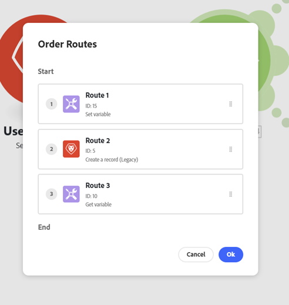

# 添加路由器模块并配置路由

路由器模块允许您将方案分为多条路由，并以不同的方式处理每条路由中的数据。 当路由器模块收到捆绑包时，它会按照路由连接到路由器模块的顺序将其转发到每个连接的路由。

路由是按顺序处理的，而不是并行处理的。 直到上一路由完全处理完某个捆绑包后，该捆绑包才会发送到下一路由。

## 访问要求

+++ 展开以查看本文中各项功能的访问要求。

您必须具有以下权限才能使用本文中的功能：

<table style="table-layout:auto">
 <col> 
 <col> 
 <tbody> 
  <tr> 
   <td role="rowheader">Adobe Workfront包</td> 
   <td> 
任何
 </td> 
  </tr> 
  <tr data-mc-conditions=""> 
   <td role="rowheader">Adobe Workfront许可证</td> 
   <td> 
新增：标准

或

当前： [！UICONTROL Work]或更高版本
 </td> 
  </tr> 
  <tr> 
   <td role="rowheader">Adobe Workfront Fusion许可证**</td> 
   <td>
   
当前：无Workfront Fusion许可证要求。

   
或

   
旧版：任意 

   </td> 
  </tr> 
  <tr> 
   <td role="rowheader">产品</td> 
   <td>
   
新：
 <ul><li>[！UICONTROL Select]或[！UICONTROL Prime] Workfront计划：您的组织必须购买Adobe Workfront Fusion。</li><li>[！UICONTROL Ultimate] Workfront计划：包括Workfront Fusion。</li></ul>
   
或

   
当前：您的组织必须购买Adobe Workfront Fusion。

   </td> 
  </tr>
 </tbody> 
</table>

有关此表中信息的更多详细信息，请参阅文档[中的](/help/workfront-fusion/references/licenses-and-roles/access-level-requirements-in-documentation.md)访问要求。

有关Adobe Workfront Fusion许可证的信息，请参阅[Adobe Workfront Fusion许可证](/help/workfront-fusion/set-up-and-manage-workfront-fusion/licensing-operations-overview/license-automation-vs-integration.md)。

+++

## 向方案添加路由器模块

在配置路由之前，必须添加路由器模块。

1. 单击左侧面板中的&#x200B;**[!UICONTROL 方案]**&#x200B;选项卡。
1. 选择要添加路由器的方案。
1. 单击方案上的任意位置以进入方案编辑器。
1. 在场景编辑器中，单击要在其后添加路由器的模块的右手柄。
1. 在显示的模块列表中选择&#x200B;**[!UICONTROL 流量控制]** > **路由器**。

   

   或

   要在两个模块之间插入路由器模块，请单击连接两个模块的路由下面的扳手图标，然后从菜单中选择&#x200B;**[!UICONTROL 添加路由器]**。

   
1. 通过单击路由器的右侧句柄并添加模块（类似于添加任何模块），向路由器添加第一条路由。
1. 要添加另一条路由，请单击路由器模块。 将出现一条路由。 根据需要向此路由添加模块。

   您可以添加任意数量的路由。

1. 要验证路由的顺序，请单击“自动对齐”图标。

   这些路由按其执行顺序排列。 首先执行顶层路由。

1. （可选）要更改路由顺序，请右键单击路由器模块，然后选择&#x200B;**对路由排序**&#x200B;按您希望路由执行的顺序拖放路由。 路由由路由器后面的第一个模块（路由的第一个模块）标记。

   

1. 继续[将筛选器添加到路由](#add-a-filter-to-a-route)。

## 将过滤器添加到工艺路线

您可以在路由器模块后面的路由上放置过滤器以过滤捆绑包。 只有通过过滤器的捆绑包才会由路由上的模块处理。

如果数据通过多条路由的过滤，则数据由两条路由处理。 顶部路由首先处理数据。

1. 单击左侧面板中的&#x200B;**[!UICONTROL 方案]**&#x200B;选项卡。
1. 选择要添加过滤器的方案。
1. 单击方案上的任意位置以进入方案编辑器。
1. 单击要设置过滤器的路径上的扳手图标。 这是路由器模块与路由的第一个模块之间的路径。
1. 选择&#x200B;**设置筛选器。**
1. 在显示的面板的标签字段中，添加标签。 此标签显示在方案中。
1. 配置筛选条件。

   有关详细信息，请参阅[将筛选器添加到方案](/help/workfront-fusion/create-scenarios/add-modules/add-a-filter-to-a-scenario.md)。

1. 单击&#x200B;**[!UICONTROL 确定]**&#x200B;以保存筛选器设置。

1. 继续[配置后备路由](#configure-a-fallback-route)。

## 配置后备路由

回退路由是在未将任何过滤器传递到另一路由的任何捆绑上执行的路由。

您可以在过滤器面板中启用回退路由。

1. 单击左侧面板中的&#x200B;**[!UICONTROL 方案]**&#x200B;选项卡。
1. 选择要添加回退路由的方案。
1. 单击方案上的任意位置以进入方案编辑器。
1. 单击要设置过滤器的路径上的扳手图标。 这是路由器模块与路由的第一个模块之间的路径。
1. 选择&#x200B;**设置筛选器。**
1. 在显示的面板的标签字段中，添加标签。 此标签显示在方案中。
1. 启用后备路由复选框。

   

1. 单击&#x200B;**[!UICONTROL 确定]**&#x200B;以保存筛选器设置。

备用路由在路由器模块中用不同的箭头标记：

## 示例：`if/else`用例

>[!BEGINSHADEBOX]

备用路由的典型使用情形是，如果满足条件，则使用一条路由继续流，如果不满足，则使用另一条路由。 与以下步骤相同：

在本例中，第一条路由配置有过滤器。 这表示`if`组件。

中设置筛选器

第二路由被配置为后备路由。 这表示`else`组件。

>[!ENDSHADEBOX]
