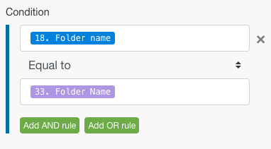

# 将筛选和嵌套添加到错误处理路由

您可以通过包括筛选和嵌套将高级错误处理技术添加到错误处理路由中。

## 访问要求

+++ 展开以查看本文中各项功能的访问要求。

您必须具有以下权限才能使用本文中的功能：

<table style="table-layout:auto">
 <col> 
 <col> 
 <tbody> 
  <tr> 
   <td role="rowheader">Adobe Workfront包 
   <td> 
任何
 </td> 
  </tr> 
  <tr data-mc-conditions=""> 
   <td role="rowheader">Adobe Workfront许可证</td> 
   <td> 
新增：标准

或

当前：工作或更高
 </td> 
  </tr> 
  <tr> 
   <td role="rowheader">Adobe Workfront Fusion许可证**</td> 
   <td>
   
当前：无Workfront Fusion许可证要求。

   
或

   
旧版：任意 

   </td> 
  </tr> 
  <tr> 
   <td role="rowheader">产品</td> 
   <td>
   
新增：
 <ul><li>选择或Prime Workfront计划：您的组织必须购买Adobe Workfront Fusion。</li><li>Ultimate Workfront计划：包含Workfront Fusion。</li></ul>
   
或

   
当前：您的组织必须购买Adobe Workfront Fusion。

   </td> 
  </tr>
 </tbody> 
</table>

有关此表中信息的更多详细信息，请参阅文档](/help/workfront-fusion/references/licenses-and-roles/access-level-requirements-in-documentation.md)中的[访问要求。

有关Adobe Workfront Fusion许可证的信息，请参阅[Adobe Workfront Fusion许可证](/help/workfront-fusion/set-up-and-manage-workfront-fusion/licensing-operations-overview/license-automation-vs-integration.md)。

+++

## 筛选

在错误处理程序路由中可能会进行两种筛选。

* [将过滤器添加到错误处理程序路由](#add-a-filter-to-the-error-handler-route)
* [在错误处理程序路由中添加路由器，后跟过滤器](#add-a-router-followed-by-filters-to-the-error-handler)

### 将过滤器添加到错误处理程序路由

您可以使用过滤器来控制错误处理程序路由处理哪些错误。 这允许您仅处理特定类型的错误。 如果错误未通过过滤器，则会将其视为没有为给定模块定义错误处理程序路由。

这些筛选器的配置方式与Fusion中的任何其他筛选器相同。 有关说明，请参阅[将筛选器添加到方案](/help/workfront-fusion/create-scenarios/add-modules/add-a-filter-to-a-scenario.md)。

### 在错误处理程序中添加路由器，后跟过滤器

将路由器添加到错误处理路由允许您为不同类型的错误配置不同的路由。

例如，要将一条路由配置为在错误为DataError时执行，您可以设置一个过滤器，在映射的错误类型等于DataError时允许数据通过。

有关Fusion如何评估和处理各种数据类型的信息，请参阅[错误类型](/help/workfront-fusion/references/errors/error-processing.md)。

### 示例：使用过滤器处理错误

>[!BEGINSHADEBOX]

此示例场景显示这些过滤器如何用于错误处理。

如果您使用“Dropbox”>“创建文件夹模块”，并且已存在同名文件夹，则模块会引发DataError：

完整方案的功能如下：

1. “工具”>“设置变量”模块包含文件夹名称
1. HTTP >获取文件模块会获取需要上载到文件夹的文件
1. 如果存在与模块中映射的文件夹同名的文件夹，则Dropbox>创建文件夹模块会引发错误
1. 错误处理程序路由（透明气泡）包含用于过滤错误的路由器
第一个路由适用于名为`DataError`的指定错误类型。

   1. 如果`DataError`发生并且错误详细信息通过筛选器，则Dropbox>列出文件夹模块中的所有文件/子文件夹将列出Dropbox中的所有文件夹。
   1. 后续筛选器与文件夹名称匹配。
   1. **Resume**&#x200B;指令指定现有文件夹的文件夹ID和文件夹路径，方案执行从“Dropbox”>“创建文件夹模块”中恢复。 但是，Fusion不会创建新文件夹，而是使用Resume指令中的值移动到下一个模块并将文件上传到现有文件夹中。

1. 第二个路由用于所有其他错误，并以Rollback指令结束，这会导致立即停止该方案

以下是DataError路由的详细说明。

要在后续模块（例如上载文件）中使用现有文件夹，您必须添加错误处理程序路由到模块，并获取要映射到“恢复”指令模块的文件夹路径，如下所示：

第一条　路由上的筛选器设置为仅处理同名文件夹已存在时出现的特定错误(DataError)：

Dropbox>列出文件夹模块中的所有文件配置为返回目标文件夹中的所有文件夹。 以下过滤器只审核我们最初尝试创建的过滤器。 (文件夹名称存储在33中。 文件夹名称项目。)

然后， Resume指令提供文件夹路径作为故障模块的输出。 请注意，文件夹ID已留空，因为上传文件模块不需要它。

>[!ENDSHADEBOX]

## 嵌套

可以在所有模块上（路由器除外）创建和配置错误处理程序路由。 因此，您可以为已经是现有错误处理程序路由一部分的模块创建错误处理程序路由。

>[!BEGINSHADEBOX]

示例：

嵌套的错误处理程序路由包含筛选器：

在此方案中，第二个错误处理程序路由嵌套在第一个错误处理程序路由下。

如果“Dropbox”>“创建文件夹”模块遇到错误，则执行将移至第一条路由。 如果传递了`DataError Takes Place`筛选器，则执行下一个模块；如果Dropbox>列出文件夹模块中的所有文件/子文件夹中未发生错误，则执行恢复指令模块。

但是，如果在Dropbox>列出文件夹模块中的所有文件/子文件夹中发生错误，则执行将移至错误处理程序路由2并以[!UICONTROL Ignore]指令结束。 在此情况下不执行[!UICONTROL Resume directive]模块。

>[!ENDSHADEBOX]
