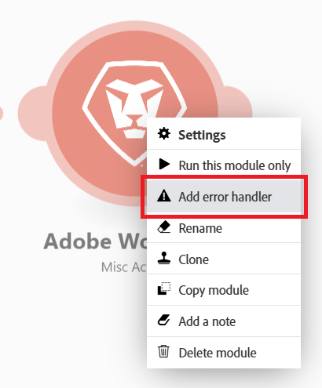

# 添加错误处理

在执行场景期间可能会出错。

例如，错误可能是由于：

* 由于故障，服务不可用
* 服务使用意外数据做出响应
* 验证输入数据失败
* 其他原因

如果模块在场景执行期间遇到错误，并且没有附加到模块的错误处理路由，则执行默认错误处理逻辑。

通过将错误处理程序路由添加到模块，可以将默认错误处理逻辑替换为您自己的错误处理逻辑。 Adobe Workfront Fusion提供了五个不同的指令，这些指令可以在错误处理程序路由的末尾插入。

有关默认错误处理的详细信息，请参阅[错误类型](/help/workfront-fusion/references/errors/error-processing.md)。

有关错误处理指令的详细信息，请参阅[错误处理指令](/help/workfront-fusion/references/errors/directives-for-error-handling.md)。

## 访问要求

+++ 展开以查看本文中各项功能的访问要求。

您必须具有以下权限才能使用本文中的功能：

<table style="table-layout:auto">
 <col> 
 <col> 
 <tbody> 
  <tr> 
   <td role="rowheader">Adobe Workfront包 
   <td> 
任何
 </td> 
  </tr> 
  <tr data-mc-conditions=""> 
   <td role="rowheader">Adobe Workfront许可证</td> 
   <td> 
新增：标准

或

当前：工作或更高
 </td> 
  </tr> 
  <tr> 
   <td role="rowheader">Adobe Workfront Fusion许可证**</td> 
   <td>
   
当前：无Workfront Fusion许可证要求。

   
或

   
旧版：任意 

   </td> 
  </tr> 
  <tr> 
   <td role="rowheader">产品</td> 
   <td>
   
新增：
 <ul><li>选择或Prime Workfront计划：您的组织必须购买Adobe Workfront Fusion。</li><li>Ultimate Workfront计划：包含Workfront Fusion。</li></ul>
   
或

   
当前：您的组织必须购买Adobe Workfront Fusion。

   </td> 
  </tr>
 </tbody> 
</table>

有关此表中信息的更多详细信息，请参阅文档](/help/workfront-fusion/references/licenses-and-roles/access-level-requirements-in-documentation.md)中的[访问要求。

有关Adobe Workfront Fusion许可证的信息，请参阅[Adobe Workfront Fusion许可证](/help/workfront-fusion/set-up-and-manage-workfront-fusion/licensing-operations-overview/license-automation-vs-integration.md)。

+++

## 添加错误处理程序

向模块添加错误处理程序：

1. 单击左侧面板中的&#x200B;**[!UICONTROL Scenarios]**&#x200B;选项卡。
1. 选择要添加错误处理路由的方案。
1. 单击方案上的任意位置以进入方案编辑器。
1. 右键单击要添加错误处理程序路由的模块，然后选择&#x200B;**[!UICONTROL Add error handler]**：

   

   错误处理程序路由已添加到模块。 如果该模块是路由中的最后一个模块，则错误处理程序将直接遵循该模块。 如果模块之后有更多的模块，则会添加单独的错误处理程序路由。

   错误处理模块显示指令列表，以及在您的方案中使用的应用程序。

   

1. 选择指令之一。

   或

   将一个或多个模块添加到错误处理程序路由。

   如果向路由添加更多模块，则缺省情况下将应用“忽略”指令。 如果出现错误，则会处理该路由上的后续模块。

   有关指令的详细信息，请参阅本文中的[处理指令](#error-handling-directives)时出错。

1. （可选）将过滤器添加到错误处理路由。 有关说明，请参阅[将筛选和嵌套添加到错误处理路由](/help/workfront-fusion/create-scenarios/config-error-handling/advanced-error-handling.md)。

>[!NOTE]
>
>请注意，错误处理程序路由由透明圆组成，而常规路由由实心圆组成。

## 处理指令时出错

这些指令简要说明如下。 有关详细信息，请参阅错误处理](/help/workfront-fusion/references/errors/directives-for-error-handling.md)的[指令。

有五个指令，可根据错误后场景执行是否继续将其分组为以下类别。

以下指令可确保场景执行继续：

* **[!UICONTROL Resume]**：允许您为出现错误的模块指定替代输出。 方案执行状态标记为成功。
* **[!UICONTROL Ignore]**：忽略该错误。 方案执行状态标记为成功。
* **[!UICONTROL Break]**：将输入存储到未完成执行的队列。 方案执行状态标记为警告。

  有关详细信息，请参阅[查看并解决未完成的执行](/help/workfront-fusion/manage-scenarios/view-and-resolve-incomplete-executions.md)。

如果发生错误时应停止场景执行，请使用以下指令之一：

* **[!UICONTROL Rollback]**：立即停止方案执行并将其状态标记为错误。
* **[!UICONTROL Commit]**：立即停止方案执行并将其状态标记为成功。

## 资源

有关错误处理的详细信息，请参阅：

* [Adobe Workfront Fusion中错误处理的指令](/help/workfront-fusion/references/errors/directives-for-error-handling.md)
* [将筛选和嵌套添加到错误处理路由](/help/workfront-fusion/create-scenarios/config-error-handling/advanced-error-handling.md)
