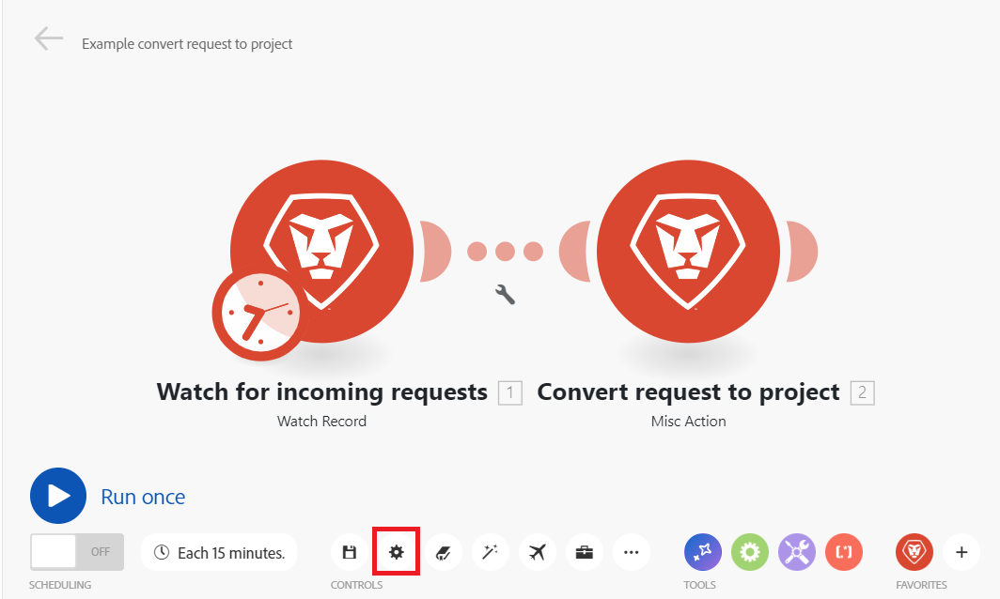

# 配置场景设置

您可以在方案设置面板中配置方案的特定设置。

## 访问权限要求

+++ 展开可查看本文所述功能的访问权限要求。

<table style="table-layout:auto">
 <col> 
 <col> 
 <tbody> 
  <tr> 
   <td role="rowheader">Adobe Workfront 包</td> 
   <td> 
任意 Adobe Workfront Workflow 包以及任意 Adobe Workfront 自动化和集成包

Workfront Ultimate

Workfront Prime 和 Select 包，且需额外购买 Workfront Fusion。
 </td> 
  </tr> 
  <tr data-mc-conditions=""> 
   <td role="rowheader">Adobe Workfront 许可证</td> 
   <td> 
标准

工作版或更高版本
 </td> 
  </tr> 
  <tr> 
   <td role="rowheader">产品</td> 
   <td>
   
如果您的组织使用的 Workfront Select 或 Prime 包不包含 Workfront 自动化和集成，则必须单独购买 Adobe Workfront Fusion。</li></ul>
   </td> 
  </tr>
 </tbody> 
</table>

有关此表中信息的更多详细说明，请参阅[文档中的访问权限要求](/help/workfront-fusion/references/licenses-and-roles/access-level-requirements-in-documentation.md)。

+++

## 打开方案设置

1. 单击左侧面板中的&#x200B;**方案**。
1. 找到所需的方案，然后单击名称。
1. 单击方案上的任意位置以输入方案编辑器。
1. 单击页面左下角附近的齿轮图标。

   

   在显示的[!UICONTROL 方案设置]面板中，您可以为该方案配置各种高级设置。
1. 根据需要启用或禁用方案设置。 请参阅下面的[方案设置选项](#scenario-settings-options)。

## 方案设置选项

### [!UICONTROL 连续处理]

此选项强制按顺序执行所有执行，并且主要与Webhook和未完成执行相关。

启用顺序处理时，将禁用方案的并行执行。

**即时Webhook**：如果将webhook触发器配置为`instant`并启用了“顺序处理”，则所有即时Webhook有效负载都将按到达的顺序排队和处理。 在以精确顺序处理来自外部系统的事件时，这可能很有用。

>[!NOTE]
>
>在处理每个有效负载后，下次启动时将会出现自动处理延迟。

**未完成的执行**：如果还启用了“未完成的执行”，则在执行场景期间发生错误时，场景将暂停。 随后会发生以下情况之一：

* 如果序列处理选项为&#x200B;**已启用**，Workfront Fusion将停止处理预先存在的序列，直到解决所有未完成的执行。
* 如果顺序处理选项为&#x200B;**已禁用**，则场景将根据其计划继续运行，同时会重复尝试重新运行未完成的执行。

  有关未完成执行的详细信息，请参阅[查看并解决未完成的执行](/help/workfront-fusion/manage-scenarios/view-and-resolve-incomplete-executions.md)。

  >[!NOTE]
  >
  >顺序处理可能会导致场景执行延迟。 当即时场景触发或计划场景设置为执行时，如果队列中仍存在未完成的执行，则该场景将在队列中的所有执行完成后执行，然后才在队列中执行。
  >
  >如果您的方案用例不需要顺序处理，我们建议禁用顺序处理选项。

  有关计划的详细信息，请参阅[计划方案](/help/workfront-fusion/create-scenarios/config-scenarios-settings/schedule-a-scenario.md)。

### 数据是机密的

执行方案后，您可以默认显示有关方案中的模块处理了哪些数据的信息。 如果不希望存储此信息，请启用[!UICONTROL 数据是机密的]选项。

>[!IMPORTANT]
>
>如果启用此选项，则可能很难解决在执行场景期间可能发生的错误。

### [!UICONTROL 允许存储未完成的执行]

此选项可确定在执行场景期间发生错误时Adobe Workfront Fusion如何进行。 启用此选项后，方案将暂停并移至不完整的执行文件夹。 这使您能够修复问题，并从场景停止的地方继续执行。 如果禁用此选项，则方案运行将停止，并且回滚阶段将启动。

有关未完成执行的详细信息，请参阅[查看并解决未完成的执行](/help/workfront-fusion/manage-scenarios/view-and-resolve-incomplete-executions.md)。

### 启用数据丢失

此选项与在Workfront Fusion无法将捆绑包保存到未完成执行的队列（例如，由于缺少可用空间）时启用数据丢失有关。 启用此选项后，数据将丢失，以防止整个场景执行过程中的中断。 当最高优先级是连续执行并且传入的错误数据没有那么重要时，此选项非常有用。

除此之外，在执行场景时，模块有时可能会遇到大于最大允许大小的文件。 在这种情况下，Workfront Fusion将按照[!UICONTROL 启用数据丢失]选项的设置继续操作，并显示一条警告消息。

有关未完成执行的详细信息，请参阅[查看并解决未完成的执行](/help/workfront-fusion/manage-scenarios/view-and-resolve-incomplete-executions.md)。

有关最大文件大小的详细信息，请参阅[Fusion性能护栏](/help/workfront-fusion/references/scenarios/fusion-performance-guardrails.md#files)。

有关警告的详细信息，请参阅[错误类型](/help/workfront-fusion/references/errors/error-processing.md)。

### [!UICONTROL 自动提交]

[!UICONTROL 自动提交]设置适用于事务并定义处理方案的方法。 如果自动提交选项处于打开状态，则每个模块上的提交阶段将在完成操作阶段后立即启动。 禁用自动提交选项后，直到对所有模块执行操作（这是默认模式）后，才会执行提交。

### 最大循环数

>[!NOTE]
>
>必须启用&#x200B;**显示高级设置**&#x200B;复选框才能看到此选项。

如果您希望防止与第三方服务的连接中断，并确保在同一场景运行内处理所有记录，则设置更多周期会很有用。

* 如果方案以轮询触发器开始，则设置定义方案执行期间允许的最大循环数。

  有关轮询触发器的详细信息，请参阅文章模块概述中的[轮询触发器](/help/workfront-fusion/get-started-with-fusion/understand-fusion/module-overview.md#polling-triggers)。

* 如果方案以即时触发器开始，则忽略该设置，并在单个方案执行期间处理所有挂起事件，即每个周期一个事件。

  有关即时触发器的详细信息，请参阅文章模块概述中的[即时触发器](/help/workfront-fusion/get-started-with-fusion/understand-fusion/module-overview.md#instant-triggers)。

* 如果方案不以触发器（即时/轮询）开头，则始终执行指定的最大循环数。

>[!BEGINSHADEBOX]

**示例：** Workfront > [!UICONTROL 监视记录]监视出现的新问题，Workfront >[!UICONTROL 转换对象]将新请求转换为项目并为其分配适当的模板。

仅当您计划方案执行时，才应用[!UICONTROL 更多周期]设置。 当您使用[!UICONTROL 运行一次]按钮时，周期设置将被考虑在内。

#### 最大循环数设置为1（默认）

Workfront >观察记录模块中的最大周期数设置为`10`。
如果将向Workfront提交100个请求，并且最大周期数字段设置为10，则运行一个方案后仍有90个文件未处理。 在下次计划场景执行中处理接下来的10个文件。

#### 最大循环数设置为10

Workfront >观察记录模块中的最大周期数设置为`10`。

如果向Dropbox文件夹添加了100个文件，且“最大循环数”选项设置为10，则会在第一个循环中处理10个文件，在第二个循环中处理下一个10个文件，在第三个循环中处理下一个10个文件，以此类推，直到处理完所有文件为止。

所有文件都在1个场景运行内处理。

您可以在方案详细信息中查看已运行的周期：

有关此页面的详细信息，请参阅[方案详细信息](/help/workfront-fusion/get-started-with-fusion/navigate-fusion/scenario-details.md)。

>[!ENDSHADEBOX]

### 连续错误数

定义在停用方案的执行之前连续执行尝试的最大次数（不包括`DataError`、`DuplicateDataError`、`ModuleTimeoutError`和`ConnectionError`）。

有关错误的详细信息，请参阅[错误类型](/help/workfront-fusion/references/errors/error-processing.md)。

>[!NOTE]
>
>如果方案以即时触发器开始，则忽略设置，并在发生第一个错误后立即停用方案。

### 工作线程池

>[!NOTE]
>
>仅当满足以下两个条件时，此设置才可见：
>
>* 您是组织管理员或所有者
>* 多个工作线程池与您的组织相关联。

此设置会将方案分配给与您的组织关联的特定工作人员池，从而允许您将资源专用于高优先级方案。

>[!NOTE]
>
>组织可以请求额外配置一个工作线程池（共2个）。
