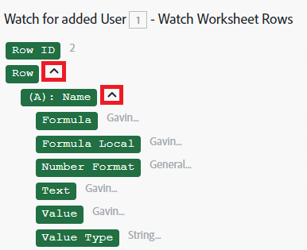

# 将信息从一个模块映射到另一个模块

映射是将一个模块的输出分配到另一个模块的输入字段的过程。

单击某个字段时，将显示映射面板，您可以在该字段中插入从场景中的上一个模块输出的值。

您还可以使用映射面板中的函数和映射项的任意组合以及键入的静态文本来创建公式。 这些元素可以相互嵌套。

## 访问权限要求

+++ 展开可查看本文所述功能的访问权限要求。

<table style="table-layout:auto">
 <col> 
 <col> 
 <tbody> 
  <tr> 
   <td role="rowheader">Adobe Workfront 包</td> 
   <td> 
任意 Adobe Workfront Workflow 包以及任意 Adobe Workfront 自动化和集成包

Workfront Ultimate

Workfront Prime 和 Select 包，且需额外购买 Workfront Fusion。
 </td> 
  </tr> 
  <tr data-mc-conditions=""> 
   <td role="rowheader">Adobe Workfront 许可证</td> 
   <td> 
标准

工作版或更高版本
 </td> 
  </tr> 
  <tr> 
   <td role="rowheader">产品</td> 
   <td>
   
如果您的组织使用的 Workfront Select 或 Prime 包不包含 Workfront 自动化和集成，则必须单独购买 Adobe Workfront Fusion。</li></ul>
   </td> 
  </tr>
 </tbody> 
</table>

有关此表中信息的更多详细说明，请参阅[文档中的访问权限要求](/help/workfront-fusion/references/licenses-and-roles/access-level-requirements-in-documentation.md)。

+++

## 映射项目

通过链接两个或多个模块创建一系列模块后，每个模块可以处理其前面的模块输出的项目值。

要将输出项分配给模块的输入字段，请执行以下操作：

1. 单击左侧面板中的&#x200B;**[!UICONTROL 方案]**&#x200B;选项卡。
1. 选择要映射数据的方案。
1. 单击方案上的任意位置以进入方案编辑器。
1. 单击应处理上述一个或多个模块输出的模块。
1. 在显示的模块设置面板中，单击要使用从前一模块输出的项目值的字段。

   将打开映射面板。

1. （可选）要在映射面板中搜索特定字段，请单击映射面板搜索栏，然后键入要搜索的搜索词。 当字段显示在列表中时，单击该字段。

   搜索结果包含搜索词且不区分大小写。
1. 要选择某个值，该值是某个收集的一个要素，请单击该收集旁边的箭头，然后在该要素出现时选择该要素。

   

1. 单击映射面板中的项以将其插入到字段中。

有关详细信息，请参阅[配置模块](/help/workfront-fusion/create-scenarios/add-modules/configure-a-modules-settings.md)。

## 故障排除

### 问题：映射面板中缺少项目

映射面板显示以前模块的输出项。 有时，此面板中可能缺少某些项目。 您可以在场景编辑器中运行缺少输出的模块，然后映射面板可以在后面的模块中包含这些项。 确切的过程因模块的类型而异。

* [即时触发](#instant-trigger)
* [Polling trigger](#polling-trigger)
* [其他模块](#other-modules)

#### 即时触发

1. Right-click the module, then click **[!UICONTROL Run this module only]** in the menu that displays.

   Because this is an instant trigger, it begins watching for events.

1. Create the event that the module is watching.

   For example, if the module is a Workfront > Watch Events module that is watching for task assignments, log into Workfront (as a user that is not the one that the Fusion connection is using) and assign a task.

1. When the module finishes running, click the bubble above the module to explore its full output.

   The mapping panel for later modules now contains all of the items in the module&#39;s output.

#### Polling trigger

1. Right-click the module, then click **[!UICONTROL Run this module only]** in the menu that displays.
1. If there is no output, click **[!UICONTROL Choose where to start]** and adjust the settings.
1. (Conditional) If there is no event to be processed, create the event that the module watches for and repeat step 2.

   For example, if the module is a Workfront > Watch records module that is watching for task assignments, log into Workfront (as a user that is not the one that the Fusion connection is using) and assign a task, then run the module again.

1. When the module finishes running, click the bubble above the module to explore its full output.

   The mapping panel for later modules now contains all of the items in the module&#39;s output.

#### 其他模块

You may choose to execute:

* The whole scenario (or just the part containing the module)
* The single module

To execute the single module:

1. Right-click the module, then click **[!UICONTROL Run this module only]** in the menu that displays..
1. Provide sample values for the input items, then click **[!UICONTROL OK]** .
1. When the module finishes running, click the bubble above the module to explore its full output.

   The mapping panel for later modules now contains all of the items in the module&#39;s output.
