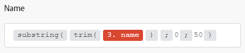

# 使用函数映射项

映射项时，可以使用函数创建简单或复杂的公式。 可用的函数类似于Excel中的函数以及某些编程语言中的函数：

* 它们评估一般逻辑、数学、文本、日期和数组。
* 它们允许您执行条件逻辑和项值的转换，例如将文本转换为大写、修剪文本、将日期转换为不同格式等。

## 访问要求

+++ 展开以查看本文中各项功能的访问要求。

您必须具有以下权限才能使用本文中的功能：

<table style="table-layout:auto">
 <col> 
 <col> 
 <tbody> 
  <tr> 
   <td role="rowheader">[!DNL Adobe Workfront] 包</td> 
   <td> 
任何
 </td> 
  </tr> 
  <tr data-mc-conditions=""> 
   <td role="rowheader">[!DNL Adobe Workfront] 许可证</td> 
   <td> 
新增： [!UICONTROL Standard]

或

当前： [!UICONTROL Work]或更高
 </td> 
  </tr> 
  <tr> 
   <td role="rowheader">[!DNL Adobe Workfront Fusion] 许可证**</td> 
   <td>
   
当前：无[!DNL Workfront Fusion]许可证要求。

   
或

   
旧版：任意 

   </td> 
  </tr> 
  <tr> 
   <td role="rowheader">产品</td> 
   <td>
   
新增：
 <ul><li>[!UICONTROL Select] 或[!UICONTROL Prime] [!DNL Workfront]计划：您的组织必须购买[!DNL Adobe Workfront Fusion]。</li><li>[!UICONTROL Ultimate] [!DNL Workfront] 计划： [!DNL Workfront Fusion]已包括在内。</li></ul>
   
或

   
当前：您的组织必须购买[!DNL Adobe Workfront Fusion]。

   </td> 
  </tr>
  <tr data-mc-conditions=""> 
   <td role="rowheader">访问级别配置*</td> 
   <td> 
     
您必须是组织的[!DNL Workfront Fusion]管理员。

     
您必须是团队的[!DNL Workfront Fusion]管理员。

   </td> 
  </tr> 
   </td> 
  </tr> 
 </tbody> 
</table>

有关此表中信息的更多详细信息，请参阅文档](/help/workfront-fusion/references/licenses-and-roles/access-level-requirements-in-documentation.md)中的[访问要求。

有关[!DNL Adobe Workfront Fusion]许可证的信息，请参阅[[!DNL Adobe Workfront Fusion] 许可证](/help/workfront-fusion/set-up-and-manage-workfront-fusion/licensing-operations-overview/license-automation-vs-integration.md)。

+++

## 在字段中插入函数

要将函数插入到字段中，请执行以下操作：

1. 单击左侧面板中的&#x200B;**[!UICONTROL Scenarios]**&#x200B;选项卡。
1. 选择要映射数据的方案。
1. 单击方案上的任意位置以进入方案编辑器。
1. 单击要插入函数的字段。
1. 在映射面板中选择包含要插入的函数的选项卡。

   有关映射面板选项卡的信息，请参阅[函数概述](/help/workfront-fusion/get-started-with-fusion/understand-fusion/function-overview.md)
   1. 单击函数名称。

      或

      将函数拖到字段中。
1. 配置函数参数。

   有关函数参数的说明，请将鼠标悬停在映射面板中的函数上。

   有关函数及其参数的详细信息，请参阅[函数引用下的文章：文章索引](/help/workfront-fusion/references/mapping-panel/functions/functions-toc.md)。

1. 继续配置模块，或单击&#x200B;**确定**。

>[!TIP]
>
>创建要在其他字段中重用的复杂公式时，可以单击包含该组合的字段，使用Cmd-A或Ctrl-A将其选中，然后将其复制并粘贴到其他字段中。

>[!BEGINSHADEBOX]

**示例：**&#x200B;某些数据类型会阻止用户输入超过一定数量的字符。 您可以使用子字符串函数将值限制为特定字符数。

在此示例中，子字符串函数将项目名称限制为50个字符。

>[!ENDSHADEBOX]

## 嵌套函数

可以将函数相互嵌套。

>[!BEGINSHADEBOX]

**示例：**

在此示例中，子字符串函数将修剪后的项目名称限制为50个字符。

>[!ENDSHADEBOX]

嵌套函数：

1. 单击要在其中创建公式的字段。

   这将打开映射面板。

1. 单击要添加的第一个函数。 这是外部的函数。 如果存在以下示例，则这是`substring`函数。
1. 在该函数中，单击希望嵌套函数放置的位置。 在此示例中，嵌套函数将替换第一个参数。
1. 在映射面板中，单击嵌套函数。 在此示例中，这是`trim`函数。
1. 根据需要继续配置函数。
1. 继续配置模块，或单击&#x200B;**确定**。

## 使用[!DNL Google Sheets]函数

如果[!DNL Workfront Fusion]不提供您要使用的函数，但它由[!DNL Google Sheets]提供，您可以按照以下步骤使用它：

1. 在[!DNL Google Sheets]中，创建一个新的空电子表格。
1. 在[!DNL Workfront Fusion]中，打开您的方案。
1. 将&#x200B;**[!DNL Google Sheets]** >**[!UICONTROL Update a cell]**&#x200B;模块添加到方案。

1. 配置模块：

   1. 在&#x200B;**[!UICONTROL Spreadsheet]**&#x200B;字段中选择新创建的电子表格。
   1. 将包含[!DNL Google Sheets]函数的公式插入到&#x200B;**[!UICONTROL Value]**&#x200B;字段中。

      您可以像往常一样使用前面的模块的输出。

      

1. 插入&#x200B;**[!UICONTROL Google Sheets]>[!UICONTROL Get a cell]**&#x200B;模块以获取计算结果。
1. 使用在步骤4中使用的相同单元格ID配置模块。

   
