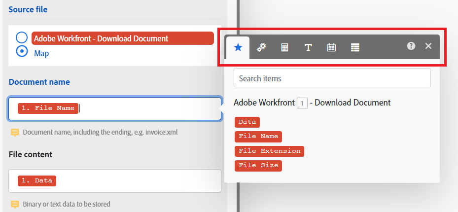

# 函数概述

在映射项目时，您可以使用函数创建简单或复杂的公式。可用的函数与 Excel 以及某些编程语言中的函数类似：

* 它们可用于处理通用逻辑、数学、文本、日期和数组。
* 它们允许您对项目值执行条件逻辑和转换，例如将文本转换为大写、裁剪文本、将日期转换为其他格式等。

## 函数选项卡概述

映射面板包含以下选项卡。每个选项卡均包含适用于该数据类型的函数与关键词。

| 函数类型 | 有关更多信息，请参阅： |
|---|---|
| **从其他模块映射**  | [将信息从一个模块映射到另一个模块](/help/workfront-fusion/create-scenarios/map-data/map-data-from-one-to-another.md) |
| **常规函数**  | [常规函数](/help/workfront-fusion/references/mapping-panel/functions/general-functions.md) |
| **数学函数**  | [数学函数](/help/workfront-fusion/references/mapping-panel/functions/math-functions.md) |
| **文本和二进制函数**  | [字符串函数](/help/workfront-fusion/references/mapping-panel/functions/string-functions.md) |
| **日期和时间**    | <ul><li>[日期和时间函数](/help/workfront-fusion/references/mapping-panel/functions/date-and-time-functions.md)</li><li>[日期和时间格式化标记](/help/workfront-fusion/references/mapping-panel/functions/tokens-for-date-and-time-formatting.md)</li><li> [日期和时间解析标记](/help/workfront-fusion/references/mapping-panel/functions/tokens-for-date-and-time-parsing.md)</li></ul> |
| **用于处理数组的函数**   | [数组函数](/help/workfront-fusion/references/mapping-panel/functions/array-functions.md) |

