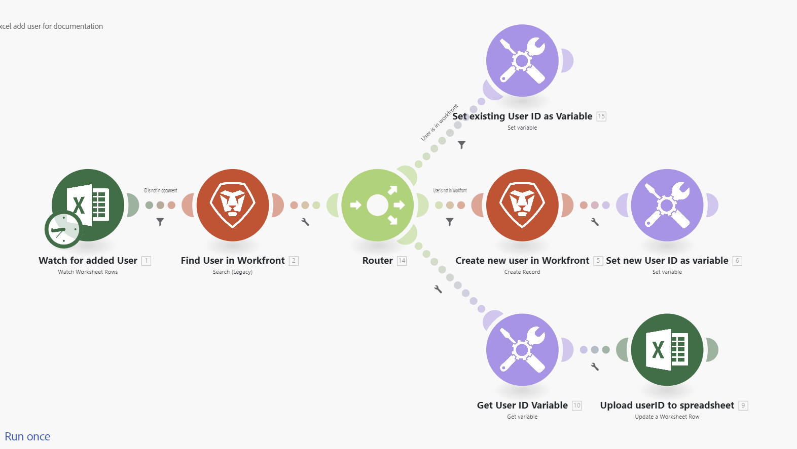

# Adobe Workfront Fusion术语表

以下术语表介绍了Adobe Workfront Fusion中的一些常用术语。

<table style="table-layout:auto">
 <col> 
 <col> 
 <tbody> 
  <tr> 
   <td role="rowheader"> 
操作
 </td> 
   <td>允许您执行操作（如从所选应用程序或服务读取数据或将数据写入所选应用程序或服务）的模块。</td> 
  </tr> 
  <tr> 
   <td role="rowheader"> 
汇总
 </td> 
   <td> 
一种模块类型，可将多个捆绑包（多个数据集合）合并到一个捆绑包中。 

有关详细信息，请参阅<a href="/help/workfront-fusion/references/modules/aggregator-module.md" class="MCXref xref">聚合器模块</a>。
 </td> 
  </tr> 
  <tr> 
   <td role="rowheader">API</td> 
   <td>应用程序编程接口(API)是应用程序和服务相互通信的一种方式。 Fusion使用API与您连接的应用程序进行通信。 每个应用程序都有一个单独的API。 </td> 
  </tr> 
  <tr> 
   <td role="rowheader">API 密钥</td> 
   <td>唯一代码，用于标识调用用于身份验证的软件API的用户、开发人员或程序。 由于Fusion模块通过连接API来工作，因此API密钥有时是必需的。 API密钥由需要它们的应用程序分发。 例如，如果您需要API密钥才能将Fusion连接到Adobe Lightroom，则可以通过Adobe Lightroom帐户请求它。</td> 
  </tr> 
  <tr> 
   <td role="rowheader">应用程序或服务</td> 
   <td> 
软件应用程序。 Fusion可以连接到大多数应用程序，即使它没有用于该应用程序的专用连接器也是如此。
 
应用程序也可以是处理数据的特殊功能，如迭代器或聚合器。 
 
服务是数据源，其中可能包括Web API、网页、不同类型的服务器(FTP、SMTP、IMAP)等。 
  </td> 
  </tr> 
  <tr> 
   <td role="rowheader"> 
捆绑
 </td> 
   <td> 
捆绑是模块返回或接收的数据的基本单位。 例如，返回三条记录的搜索模块将输出三包数据，每条记录一个。 捆绑包由项目组成。
 </td> 
  </tr> 
  <tr>
   <td role="rowheader"> 
连接
 </td> 
   <td> 
连接表示连接到给定服务的一组凭据。 您可以在任意模块中配置连接，然后可以在任何其他模块中使用该连接。 每个模块都必须选择一个连接，以便Fusion可以使用这些凭据访问模块所需的信息。 

有关详细信息，请参阅<a href="/help/workfront-fusion/get-started-with-fusion/understand-fusion/connection-overview.md" class="MCXref xref">连接概述</a>。
 </td> 
  </tr> 
  <tr> 
   <td role="rowheader">连接器</td> 
   <td>连接器是给定应用程序的一组模块。 Workfront Fusion为许多常见的工作应用程序(如Workfront、Salesforce和Jira)提供连接器。</td> 
  </tr> 
  <tr> 
   <td role="rowheader"> 
周期
 </td> 
   <td> 
一个周期包含方案运行的两阶段：操作和提交。 此方案可能包含一个或多个周期。 有关详细信息，请参阅<a href="/help/workfront-fusion/references/scenarios/scenario-execution-cycles-phases.md" class="MCXref xref">方案执行、周期和阶段</a>。
 </td> 
  </tr> 
  <tr> 
   <td role="rowheader"> 
数据存储
 </td> 
   <td> 
数据存储存储来自场景的数据，或者允许您在单个场景或场景运行之间传输数据。 

有关详细信息，请参阅<a href="/help/workfront-fusion/create-scenarios/map-data/data-stores.md" class="MCXref xref">数据存储</a>。
 </td> 
  </tr> 
  <tr> 
   <td role="rowheader"> 
筛选条件
 </td> 
   <td> 
 过滤器可以在两个模块之间应用，并允许您随后仅使用符合特定条件的包。 您可以应用许多不同的过滤器。 

有关详细信息，请参阅<a href="/help/workfront-fusion/create-scenarios/add-modules/add-a-filter-to-a-scenario.md" class="MCXref xref">将筛选器添加到方案</a>。
 </td> 
  </tr> 
  <tr> 
   <td role="rowheader"> 
ID 
 </td> 
   <td> 
用于唯一标识捆绑包的名称。 ID通常用于区分要从给定服务中更新或删除的捆绑包。 ID可以从上一个模块的输出进行映射。
 </td> 
  </tr> 
  <tr> 
   <td role="rowheader"> 
项
 </td> 
   <td> 
捆绑的一部分。 捆绑包可以包含多个项目。 有多种不同类型的项目：文本、数字、布尔值（是/否）、日期、时间、缓冲区（二进制数据）、集合、选择菜单、数组和验证。

 有关详细信息，请参阅<a href="/help/workfront-fusion/references/mapping-panel/data-types/item-data-types.md" class="MCXref xref">项目数据类型</a>。
 </td> 
  </tr>
  <tr> 
   <td role="rowheader"> 
迭代器
 </td> 
   <td> 
一种模块类型，允许您获取一捆数据（一组数据）并划分为单独的捆绑包。 随后，这些捆绑包可以由后续模块单独处理。 

有关详细信息，请参阅<a href="/help/workfront-fusion/references/modules/iterator-module.md" class="MCXref xref">[!UICONTROL Iterator]模块</a>。
 </td> 
  </tr> 
  <tr> 
   <td role="rowheader"> 
模块
 </td> 
   <td> 
方案中的单一步骤，在关联的应用程序或服务中执行功能，例如创建记录。
 
每个应用程序或服务都有各种模块定义其响应请求的方式。
  
  
 
有关详细信息，请参阅<a href="/help/workfront-fusion/get-started-with-fusion/understand-fusion/module-overview.md" class="MCXref xref">模块概述</a>。
 </td> 
  </tr> 
  <tr> 
   <td role="rowheader"> 
操作
 </td> 
   <td> 
模块执行的任务，如检索记录或上传文件。

有关详细信息，请参阅<a href="/help/workfront-fusion/set-up-and-manage-workfront-fusion/licensing-operations-overview/operations-in-workfront-fusion.md" class="MCXref xref">操作</a>。

  </tr> 
  <tr> 
   <td role="rowheader">公钥/私钥</td> 
   <td>公钥和私钥用于加密和解密数据。 公钥可以分发，任何拥有公钥的人都可以加密数据，但只有私钥可以解密。 同样，拥有私钥的用户可以加密任何拥有公钥的用户都可以解密的数据。 私钥加密可确保数据来自私钥的所有者，并用作数据来源的验证。</td> 
  </tr> 
  <tr> 
   <td role="rowheader"> 
路由器
 </td> 
   <td>路由器允许您复制数据或向场景添加新路由，以便重新路由数据并单独处理不同的数据组。

 有关详细信息，请参阅<a href="/help/workfront-fusion/create-scenarios/add-modules/router-module.md" class="MCXref xref">[!UICONTROL Router]模块</a>。</td> 
  </tr> 
  <tr> 
   <td role="rowheader"> 
方案
 </td> 
   <td> 
用户创建的一系列自动化步骤，每个步骤均由模块表示和执行。 场景的目的是移动和处理数据。
 
  
 
 有关详细信息，请参阅<a href="/help/workfront-fusion/get-started-with-fusion/understand-fusion/scenario-overview.md" class="MCXref xref">方案概述</a>。
 </td> 
  </tr> 
  <tr> 
   <td role="rowheader"> 
方案区段
 </td> 
   <td> 
 场景区段是场景的一部分，该场景包含一系列全部连接到同一应用程序的模块。 场景区段通常表示应用程序中的简短工作流。
 </td> 
  </tr> 
  <tr> 
   <td role="rowheader"> 
触发器
 </td> 
   <td> 
触发器是一种模块，用于监视新的和更新的数据，并在模块中配置的某些条件应用时启动场景。 可以将触发器配置为按计划启动方案（轮询），或在发生数据更改时启动方案（即时触发器或webhook）。
 
有关详细信息，请参阅模块概述文章中的<a href="/help/workfront-fusion/get-started-with-fusion/understand-fusion/module-overview.md" class="MCXref xref">触发器</a>。
 </td> 
  </tr> 
  <tr> 
   <td role="rowheader"> 
Webhook
 </td> 
   <td> 
一种特殊类型的触发器，允许您在新捆绑包可用后立即运行场景。 

有关详细信息，请参阅<a href="/help/workfront-fusion/references/modules/webhooks-reference.md" class="MCXref xref">即时触发器(webhook)</a>。
 </td> 
  </tr> 
 </tbody> 
</table>
