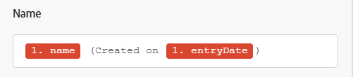
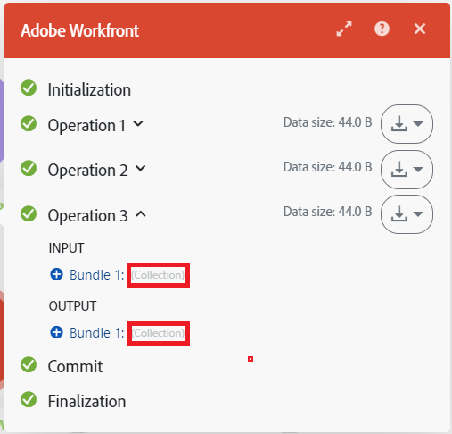

# 映射概述

映射是将一个模块的输出分配到另一个模块的输入字段的过程。

模块运行后会生成零个、一个或多个捆绑包作为输出。捆绑包由一个或多个项目组成。

您可以将这些项目映射到后续模块的字段中。

当您点击场景中可插入前一模块输出值的字段时，映射面板会随即显示。您可以在此选择要映射的项目。映射可包含以下一种或多种内容：

* 单个项目
* 多个项目
* 静态文本
* 函数

>[!BEGINSHADEBOX]

**示例**：

单个项目

多个项目与文本组合

包含多个项目与文本的函数

>[!ENDSHADEBOX]

有关映射的操作说明，请参阅[映射数据：文章索引](/help/workfront-fusion/create-scenarios/map-data/map-data-toc.md)中的文章。

>[!NOTE]
>
>位于[!UICONTROL 迭代器]和[!UICONTROL 聚合器]之间的模块，其输出在通过[!UICONTROL 聚合器]模块后将无法再被访问。

## 映射面板

当您点击一个可映射数据的字段时，映射面板会自动打开。

第一个标签页会显示可从其他模块映射的项目。

其他标签页包含可用于创建公式的函数、运算符和关键字。这些内容会根据其处理的数据类型分组到不同的标签页中。

有关函数标签页的更多信息，请参阅[函数概述](/help/workfront-fusion/get-started-with-fusion/understand-fusion/function-overview.md)。

有关使用函数映射项目的更多信息，请参阅[使用函数映射项目](/help/workfront-fusion/create-scenarios/map-data/map-using-functions.md)。

## 收藏集

项目可以包含多种类型的多个值。这些属于收藏集类型项目。

收藏集类型的捆绑包会在模块输出的捆绑包标签旁显示 `(Collection)`。

在大多数情况下，您会映射收藏集中的各个元素，而不是映射代表整个收藏集的项目。

在映射面板中查找收藏集元素时，请点击收藏集旁的箭头。

有关收藏集的更多信息，请参阅[项目数据类型](/help/workfront-fusion/references/mapping-panel/data-types/item-data-types.md)。

有关映射收藏集的操作说明，请参阅文章《将一个模块的信息映射到另一个模块》中的[映射项目](/help/workfront-fusion/create-scenarios/map-data/map-data-from-one-to-another.md#map-an-item)。

## 数组

项目可以包含多个相同类型的值。这些属于数组类型项目。

数组类型的捆绑包会在模块输出的捆绑包标签旁显示 `(Array)`。

在映射面板中，数组会以方括号形式显示。您可以通过项目标签末尾的方括号来识别数组类型项目。要在映射面板中查找数组的具体元素，请点击数组旁的箭头。

有关映射数组及数组元素的详细信息和操作说明，请参阅[映射数组及数组元素](/help/workfront-fusion/create-scenarios/map-data/map-an-array.md)。
