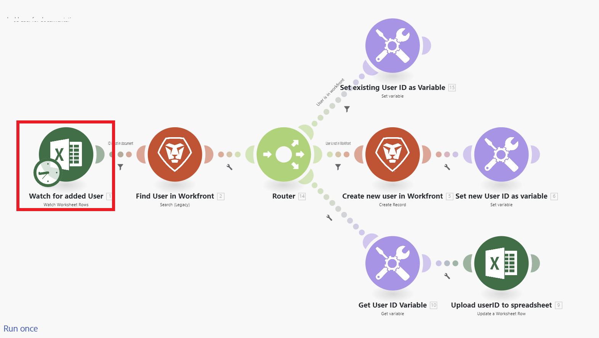

# 方案概述

Adobe Workfront Fusion的职责是自动化您的流程，这样您的用户就不需要在例行任务上花费太多时间。 它的工作方式是，关联应用程序和服务内外的操作，从而创建一个自动传输和转换数据的方案。 您创建的方案会监视应用程序或服务中的数据，并对这些数据进行处理以提供您想要的结果。

场景由一系列模块组成，这些模块指示应如何在应用程序内转换数据或在应用程序和Web服务之间传输数据。

## 方案元素概述

场景由不同的元素构建。 了解这些元素的术语可使文档更易于使用。

* [方案](#scenario)
* [触发器](#trigger)
* [模块](#module)
* [路由](#route)
* [方案区段](#scenario-segment)
* [连接器](#connector)

### 方案

**方案**&#x200B;是用户创建的一系列自动步骤，创建这些步骤是为了移动和处理数据。 术语“场景”是指连接步骤的整个组。

### 触发器

方案以&#x200B;**触发器**&#x200B;开头。 触发器会监视新的和更新的数据，并在模块中配置的某些条件适用时启动场景。 触发器可以配置为按计划启动方案（轮询），或者在发生数据更改时启动方案（即时）。

### 模块

触发器后面跟有许多&#x200B;**模块**。 模块表示执行特定操作的方案中的单一步骤。 模块已配置并链接在一起，以创建方案。

### 路由

方案可分为&#x200B;**个路由**。 路由是场景的一部分，不一定用于给定的数据捆绑。 路由是使用路由器模块和过滤器设置的。

### 方案区段

方案区段是方案的一部分，由一系列连接到同一应用程序的连续模块组成。 场景区段通常表示应用程序中的简短工作流。

### 连接器

连接器是给定应用程序的一组模块。 Workfront Fusion提供了用于许多常见工作应用程序(如Workfront、Salesforce和Jira)的连接器，以及可用于任何Web服务的通用连接器。

## 示例

展开以下部分以查看示例场景及其解释。

+++**在Adobe Workfront中自动化进程**

通过Workfront Fusion，您可以在Workfront中自动执行简单或复杂的工作流，从而节省时间并确保以一致的方式执行该流程。

在此示例中，当在Workfront中的任务或问题中的指定字段发生更改时，将触发该方案。 触发时，场景获取相关项目中的信息，并为分配给项目上特定角色的人员创建量身定制的更新。

+++

+++**正在将Workfront连接到其他应用或Web服务**

>[!NOTE]
>
>如果您的组织使用旧版许可模型，则贵组织必须具有Workfront Fusion for Work Automation and Integration许可证才能连接到其他应用程序。

Workfront Fusion可以连接到其他应用程序和Web服务。 您可以从其他应用程序访问、导入、处理或导出数据，并将它们与Workfront集成或相互集成。

许多应用程序都有专用的Workfront Fusion连接器。 如果您要访问的应用程序没有专用连接器，则可以使用Workfront Fusion的HTTP或SOAP模块通过其API连接到应用程序。

在此示例中，将用户添加到[!DNL Excel]电子表格时会触发该方案。 场景检查用户是否在Workfront中。 如果不能，则该场景将在Workfront中创建用户，并将他们的Workfront用户ID添加回电子表格。

有关专用连接器的列表，请参阅[Fusion应用程序及其模块引用：文章索引](/help/workfront-fusion/references/apps-and-modules/apps-and-modules-toc.md)。

>[!IMPORTANT]
>
>Adobe Workfront Fusion可以连接到几乎任何Web服务。 如果要使用的应用程序没有专用的Workfront Fusion连接器，则可以使用通用连接器连接到该应用程序或服务。
>
>有关通用连接器的列表，请参阅[通用连接器](/help/workfront-fusion/references/apps-and-modules/apps-and-modules-toc.md#universal-connectors)

+++

## 引用

* 有关Workfront Fusion中使用的术语表，请参阅[Adobe Workfront Fusion术语表](/help/workfront-fusion/get-started-with-fusion/understand-fusion/fusion-glossary.md)。
* 要开始构建实践方案，请参阅[创建基本方案](/help/workfront-fusion/build-practice-scenarios/create-basic-scenario.md)。
* 有关创建和管理场景的信息，请参阅下面列出的文章：
   * [创建方案](/help/workfront-fusion/create-scenarios/create-scenarios-toc.md)
   * [管理方案](/help/workfront-fusion/manage-scenarios/manage-scenarios-toc.md)
