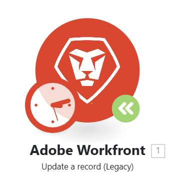

# 将模块升级到新版本

由于Workfront Fusion连接的应用程序可能会更新或发布新版本，因此Fusion有时需要为这些应用程序发布更新的模块。

如果您在场景中的某个模块上看到绿色的升级模块图标，表示Workfront Fusion已发布该模块的新版本。

您可以更新模块，而无需创建新方案。

## 访问要求

+++ 展开以查看本文中各项功能的访问要求。

您必须具有以下权限才能使用本文中的功能：

<table style="table-layout:auto">
 <col> 
 <col> 
 <tbody> 
  <tr> 
   <td role="rowheader">Adobe Workfront包</td> 
   <td> 
任何
 </td> 
  </tr> 
  <tr data-mc-conditions=""> 
   <td role="rowheader">Adobe Workfront许可证</td> 
   <td> 
新增：标准

或

当前： [！UICONTROL Work]或更高版本
 </td> 
  </tr> 
  <tr> 
   <td role="rowheader">Adobe Workfront Fusion许可证**</td> 
   <td>
   
当前：无Workfront Fusion许可证要求。

   
或

   
旧版：任意 

   </td> 
  </tr> 
  <tr> 
   <td role="rowheader">产品</td> 
   <td>
   
新：
 <ul><li>[！UICONTROL Select]或[！UICONTROL Prime] Workfront计划：您的组织必须购买Adobe Workfront Fusion。</li><li>[！UICONTROL Ultimate] Workfront计划：包括Workfront Fusion。</li></ul>
   
或

   
当前：您的组织必须购买Adobe Workfront Fusion。

   </td> 
  </tr>
  <tr data-mc-conditions=""> 
   <td role="rowheader">访问级别配置*</td> 
   <td> 
     
您必须是组织的Workfront Fusion管理员。

     
您必须是团队的Workfront Fusion管理员。

   </td> 
  </tr> 
   </td> 
  </tr> 
 </tbody> 
</table>

有关此表中信息的更多详细信息，请参阅文档[中的](/help/workfront-fusion/references/licenses-and-roles/access-level-requirements-in-documentation.md)访问要求。

有关Adobe Workfront Fusion许可证的信息，请参阅[Adobe Workfront Fusion许可证](/help/workfront-fusion/set-up-and-manage-workfront-fusion/licensing-operations-overview/license-automation-vs-integration.md)。

+++

## 将Workfront模块升级到新版本

1. 单击要升级到新版本的模块上的&#x200B;**升级模块**&#x200B;图标。
   
1. 选择下列选项之一：

   * 要选择新模块以替换此模块（而不是升级此模块），请单击&#x200B;**选择新模块**，然后按照[将非Workfront模块升级到新版本](#upgrade-a-non-workfront-module-to-a-new-version)中的说明继续操作。
   * 要仅升级此模块，保留模块配置，请单击&#x200B;**升级**。
   * 若要升级方案中的所有Workfront模块，请单击&#x200B;**全部升级**。

1. 保存该场景。

>[!NOTE]
>
>如果您已升级Workfront模块，我们建议您打开它们并检查模块配置。

## 将非Workfront模块升级到新版本

1. 单击要升级到新版本的模块上的&#x200B;**升级模块**&#x200B;图标。
   
1. 单击&#x200B;**选择新**。
1. 选择要替换前一模块的模块。
1. 使用与现有模块相同的设置配置模块。
1. 将新模块连接到与现有模块相同的场景中。
1. 删除旧模块。
1. 保存该场景。
