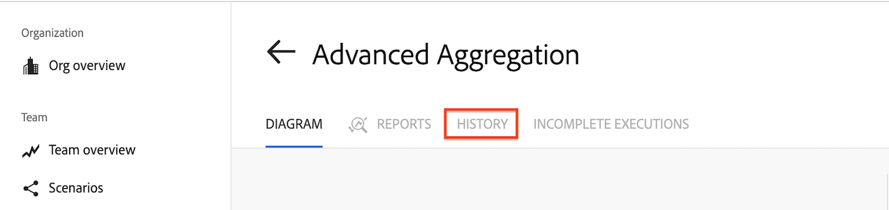

# 查看场景的执行历史

您可以显示有关场景的事件或执行的信息，也可以搜索场景的所有执行以获取特定数据。

场景执行表示场景的单次运行。

场景事件是对场景的修改，如编辑、激活或停用场景。

>[!NOTE]
>
>方案的历史记录显示方案在过去30天内的所有执行。

## 访问权限要求

+++ 展开可查看本文所述功能的访问权限要求。

<table style="table-layout:auto">
 <col> 
 <col> 
 <tbody> 
  <tr> 
   <td role="rowheader">Adobe Workfront 包</td> 
   <td> 
任意 Adobe Workfront Workflow 包以及任意 Adobe Workfront 自动化和集成包

Workfront Ultimate

Workfront Prime 和 Select 包，且需额外购买 Workfront Fusion。
 </td> 
  </tr> 
  <tr data-mc-conditions=""> 
   <td role="rowheader">Adobe Workfront 许可证</td> 
   <td> 
标准

工作版或更高版本
 </td> 
  </tr> 
  <tr> 
   <td role="rowheader">产品</td> 
   <td>
   
如果您的组织使用的 Workfront Select 或 Prime 包不包含 Workfront 自动化和集成，则必须单独购买 Adobe Workfront Fusion。</li></ul>
   </td> 
  </tr>
 </tbody> 
</table>

有关此表中信息的更多详细说明，请参阅[文档中的访问权限要求](/help/workfront-fusion/references/licenses-and-roles/access-level-requirements-in-documentation.md)。

+++

## 查看方案历史记录

### 在“历史记录”选项卡上查看方案历史记录

[!UICONTROL 历史记录]选项卡显示的详细信息比[!UICONTROL 方案详细信息]页面上提供的多。 您还可以对[!UICONTROL 历史记录]选项卡上的执行进行过滤和排序。

>[!NOTE]
>
>如果在方案历史记录仍在运行时查看它，Fusion将显示一条注释，通知您数据仍在处理中，在处理完成之前，只显示部分方案历史记录。

1. 单击左侧面板中的&#x200B;**[!UICONTROL 方案]**&#x200B;选项卡，然后单击方案。

   或

   如果您在方案编辑器中处理方案，请单击窗口左上角附近的左箭头。

1. 单击方案名称附近的&#x200B;**历史记录**。
   

   针对方案的每次执行都列出了以下详细信息：

   * 运行开始日期&#x200B;**&#x200B;**
   * 执行Id
   * **[!UICONTROL 状态]** （成功或失败）
   * 运行&#x200B;**[!UICONTROL 持续时间]**
   * **[!UICONTROL 操作数]**
   * **[!UICONTROL 数据传输的大小]**

   >[!NOTE]
   >
   >方案历史记录会在最近执行的方案旁边显示一个&#x200B;**正在处理**&#x200B;标记，同时将执行详细信息写入存储。 在场景执行后立即进行处理。 并且持续时间不应超过几分钟。 处理执行时，场景执行的详细信息可能不可见。

1. 要查看特定方案执行的详细信息，请单击最右侧的&#x200B;**详细信息**。 仅当执行有详细信息时，[!UICONTROL 详细信息]链接才可见。

   有关查看方案执行详细信息的详细信息，请参阅[查看特定方案执行](/help/workfront-fusion/manage-scenarios/view-a-specific-scenario-execution.md)。
1. 要查看事件，请打开&#x200B;**显示事件**。

### 在“方案详细信息”页面上查看方案历史记录

1. 单击左侧面板中的&#x200B;**[!UICONTROL 方案]**&#x200B;选项卡，然后单击方案。

   或

   如果您在方案编辑器中处理方案，请单击窗口左上角附近的左箭头。

1. 单击右侧面板中的&#x200B;**[!UICONTROL 历史记录]**&#x200B;选项卡。
1. （可选）有关所选方案运行的详细信息，请单击右侧面板中的执行。

   有关处理捆绑包的详细信息，请参阅[方案执行流程](/help/workfront-fusion/references/scenarios/scenario-execution-flow.md)

   >[!NOTE]
   >
   >* 方案历史记录会在最近执行的方案旁边显示一个&#x200B;**处理历史记录**&#x200B;标记，同时将执行详细信息写入存储。 在场景执行后立即进行处理。 并且持续时间不应超过几分钟。 处理执行时，场景执行的详细信息可能不可见。

1. 要查看事件，请单击&#x200B;**事件**&#x200B;选项卡。

## 筛选场景执行历史记录

您可以过滤执行历史记录以仅查看具有指定值的执行。

1. 打开方案的全页历史记录，如本文中[历史记录[!UICONTROL 选项卡]上的](#view-scenario-history-on-the-history-tab)查看方案执行历史记录中所述。
1. 单击要作为筛选依据的列标题中的[!UICONTROL 筛选器]图标。
1. 在[!UICONTROL 筛选器]对话框中，输入筛选依据的值。
1. 单击&#x200B;**[!UICONTROL 保存]**。

过滤器图标在有活动过滤器的列中呈橙色。

<!-- don't see how to do this
## Sort the scenario execution history

You can sort the scenario execution history.

1. Open the full-page history for a scenario as described in [View scenario execution history on the [!UICONTROL History] tab](#view-scenario-execution-history-on-the-history-tab) in this article.
1. Click the [!UICONTROL Sort] icon in the header of the column you want to filter by.
1. Optional: To reverse the order of the sort, click the [!UICONTROL Sort] icon again.
-->

## 搜索场景的所有执行

1. 打开方案的全页历史记录，如本文中[历史记录[!UICONTROL 选项卡]上的](#view-scenario-history-on-the-history-tab)查看方案执行历史记录中所述。
1. 单击执行列表顶部的&#x200B;**[!UICONTROL 全文搜索]**。

   或

   键入&#x200B;**Ctrl+Shift+F** (Windows)或&#x200B;**Cmd+Shift+F** (Mac)
将打开[!UICONTROL 在历史记录中搜索]窗口。

1. （可选）要搜索包含特定文本的执行内容，请在&#x200B;**[!UICONTROL 在历史记录中搜索]**&#x200B;窗口的搜索栏中输入文本。

   要搜索精确文本，请用双引号将文本括起来（“示例”）。

   >[!INFO]
   >
   >**示例：**&#x200B;如果要查找创建特定项目的执行，请在[!UICONTROL 全文搜索]栏中输入项目ID。
   >
   >“625ef2ef0006036bd1794b6e52d737c5”

1. （可选）要按日期范围限制搜索，请在[!UICONTROL 按日期范围]区域中选择所需搜索的开始和结束日期。

   >[!NOTE]
   >
   >* 执行仅可用于之前的30天。
   >
   >* Workfront Fusion 会将 Webhook 的负载存储 30 天。创建webhook有效负载超过30天后对其进行访问会导致错误“[!UICONTROL 无法从存储中读取文件。]”

1. （可选）要按状态限制搜索，请在&#x200B;**[!UICONTROL 按状态]**&#x200B;下拉列表中选择所需的状态。

   可用状态包括：

   * [!UICONTROL 全部]

   * [!UICONTROL 错误]

   * [!UICONTROL Warning]

   * [!UICONTROL 成功]

1. （可选）更改结果在&#x200B;**[!UICONTROL 按日期排序]**&#x200B;下拉列表中的显示顺序。

1. （可选）要复制场景执行ID，请单击&#x200B;**[!UICONTROL 复制执行ID]**&#x200B;图标 所需执行的行中的。

1. （可选）单击[!UICONTROL 全文搜索]的结果以检查包含该信息的方案模块输出包。
