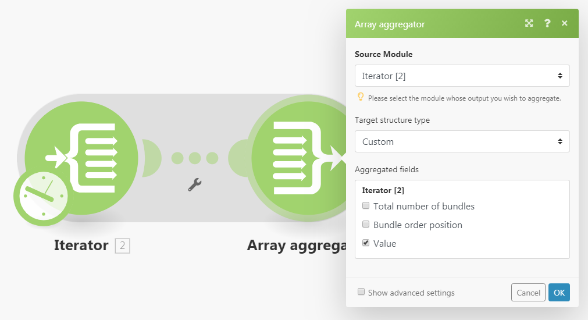

# [!UICONTROL Aggregator]模块

聚合器模块是将多捆数据合并到单个捆绑包中的模块。

## 访问要求

+++ 展开以查看本文中各项功能的访问要求。

您必须具有以下权限才能使用本文中的功能：

<table style="table-layout:auto">
 <col> 
 <col> 
 <tbody> 
  <tr> 
    <td role="rowheader">[!DNL Adobe Workfront] 包</td> 
   <td> 
任何
 </td> 
  </tr> 
  <tr data-mc-conditions=""> 
   <td role="rowheader">[!DNL Adobe Workfront] 许可证</td> 
   <td> 新增：标准
或

当前：工作或更高
 </td> 
  </tr> 
  <tr> 
   <td role="rowheader">[!UICONTROL Adobe Workfront Fusion] 许可证</td> 
   <td>
   
当前：无[!DNL Workfront Fusion]许可证要求。

   
或

   
旧版：任意 

   </td> 
  </tr> 
  <tr> 
   <td role="rowheader">产品</td> 
   <td>
   
新增：
 <ul><li>[!UICONTROL Select] 或[!UICONTROL Prime] [!DNL Workfront]计划：您的组织必须购买[!DNL Adobe Workfront Fusion]。</li><li>[!UICONTROL Ultimate] [!DNL Workfront] 计划： [!DNL Workfront Fusion]已包括在内。</li></ul>
   
或

   
当前：您的组织必须购买[!DNL Adobe Workfront Fusion]。

   </td> 
  </tr>
 </tbody> 
</table>

要了解您拥有什么计划、许可证类型或访问权限，请与[!DNL Workfront]管理员联系。

有关Adobe Workfront Fusion许可证的信息，请参阅[[!DNL Adobe Workfront Fusion] 许可证](/help/workfront-fusion/set-up-and-manage-workfront-fusion/licensing-operations-overview/license-automation-vs-integration.md)。

+++

## [!UICONTROL Aggregator]模块概述

执行[!UICONTROL Aggregator]模块时，它将执行以下操作：

* 从单个源模块的操作中累积所有包。
* 输出一个包，其数组包含每个累积包的一个项目。 数组项的内容取决于特定的[!UICONTROL Aggregator]模块及其设置。

下图显示了[!UICONTROL Aggregator]模块的典型设置：

<table style="table-layout:auto">
 <col> 
 <col> 
 <tbody> 
  <tr> 
   <td> 
[!UICONTROL Source Module]
 </td> 
   <td> 
捆绑聚合开始的模块。 源模块通常是输出一系列捆绑包的迭代器或搜索模块。

设置聚合器源模块（并关闭聚合器设置）时，源模块和聚合器模块之间的路由将封装在灰色区域中，以便您可以清楚地看到聚合的开始和结束。 
   
 
有关迭代器的详细信息，请参阅<a href="/help/workfront-fusion/references/modules/iterator-module.md" class="MCXref xref">[!UICONTROL Iterator]模块</a>。
 
   
有关搜索模块的详细信息，请参阅模块概述中的<a href="/help/workfront-fusion/get-started-with-fusion/understand-fusion/module-overview.md#search-modules" class="MCXref xref">搜索模块</a>。
 </td> 
  </tr> 
  <tr> 
   <td> 
[!UICONTROL Target structure type]

（仅适用于[!UICONTROL Array aggregator]模块。）
 </td> 
   <td> 
 聚合数据的目标结构。 默认选项[!UICONTROL Custom]允许您选择应聚合到[!UICONTROL Array aggregator]的输出捆绑包的<code>Array </code>项中的项：
 
  
 
在[!UICONTROL Array aggregator]模块之后连接更多模块并返回聚合器模块的设置后，[!UICONTROL Target]结构类型下拉菜单将包含以下所有模块及其字段的“集合数组”类型。 
在此示例中，[!DNL Slack] &gt;[!UICONTROL Create a Message]模块的[!UICONTROL Attachments]字段显示在数组汇总&gt;目标结构类型字段中。 
 
  
 </td> 
  </tr> 
  <tr> 
   <td>[!UICONTROL Aggregated fields]</td> 
   <td>要包含在聚合器模块输出中的字段。</td> 
  </tr> 
  <tr> 
   <td> 
[!UICONTROL Group by]
 </td> 
   <td> 
使用“分组依据”字段，您可以定义包含一个或多个映射项的表达式。 然后，聚合的数据将按表达式的值分成组。 每个组输出为一个单独的捆绑包，包含一个键和一个数据数组。 通过对结果进行分组，您可以在后续模块中将键用作过滤器。

   
每个捆绑包包含两个项目：
 
    <ul> 
     <li><code>Key</code>：您作为分组依据的值。</li> 
     <li><code>Array</code>：公式计算为<code>Key</code>值的捆绑中的聚合数据。</li> 
    </ul> </td> 
  </tr> 
  <tr> 
   <td> 
在空聚合后停止处理
 </td> 
   <td> 
默认情况下，[!UICONTROL Aggregator]模块输出聚合结果，即使没有捆绑包到达[!UICONTROL Aggregator]模块也是如此（例如，因为已从包含聚合器的路径中筛选出这些捆绑包）。 如果启用了选项[!UICONTROL Stop processing after an empty aggregation]，则当没有输入捆绑包时，[!UICONTROL Aggregator]模块不会生成任何输出捆绑包。 相反，流量会停止。
 </td> 
  </tr> 
 </tbody> 
</table>

>[!NOTE]
>
>[!UICONTROL Aggregator]模块不输出源模块和[!UICONTROL Aggregator]模块之间模块生成的捆绑包。 这些捆绑包无法由[!UICONTROL Aggregator]之后的流中的模块访问。 如果您需要源模块和[!UICONTROL Aggregator]模块之间的模块输出的捆绑包中的任何数据，请确保在[!UICONTROL Aggregator]模块的设置中包含给定项（例如，在[!UICONTROL Array aggregator]模块设置的[!UICONTROL Aggregated fields]字段中）。

## 聚合器如何工作的示例场景

此示例方案显示如何压缩所有电子邮件附件并将ZIP文件上传到[!DNL Dropbox]。

以下方案显示如何：

* 第一个模块监视邮箱是否有传入电子邮件。 [!UICONTROL Email] >[!UICONTROL Watch emails]触发器输出包含项`Attachments[]`的捆绑包，该项是一个包含电子邮件所有附件的数组。

* 第二个模型迭代电子邮件的附件： [!UICONTROL Email] >[!UICONTROL Iterate attachments]迭代器逐个从`Attachments[]`数组获取项目，然后作为单独的捆绑包进一步发送它们。

* 第三个模块是聚合器。 它会汇总[!UICONTROL Email] >[!UICONTROL Iterate attachments]模块输出的包。 [!UICONTROL Archive] >[!UICONTROL Create an archive aggregator]累计它收到的所有捆绑包并输出包含ZIP文件的单个捆绑包。

* 最后一个模块会将生成的ZIP文件上载到[!DNL Dropbox]。  [!DNL Dropbox] > [!UICONTROL Upload a file]从[!UICONTROL Archive] > [!UICONTROL Create an archive]模块获取ZIP文件并将其上载到[!DNL Dropbox]。

以下是[!UICONTROL Archive] > [!UICONTROL Create an archive]聚合器的示例设置：

