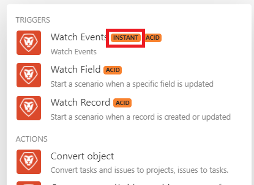

# 即时触发器(webhook)

许多服务都提供Webhook，以便在服务中发生特定更改（事件）时即时发送通知。 要处理这些事件，我们建议您使用即时触发器。 即时触发器显示给定连接器的模块列表中的`Instant`标记。

>[!TIP]
>
>您可以检查连接器中的模块列表，以查看它是否具有即时触发器，也可以检查[Fusion应用程序及其模块引用](/help/workfront-fusion/references/apps-and-modules/apps-and-modules-toc.md)下的连接器文档。
>
>有关Adobe Workfront instant trigger文档，请参阅Workfront模块一文中的[Triggers](/help/workfront-fusion/references/apps-and-modules/adobe-connectors/workfront-modules.md#triggers)。

如果连接器不包含webhook，则可以执行以下操作之一：

* 使用Webhook模块创建自定义webhook。
有关详细信息，请参阅[Webhooks](/help/workfront-fusion/references/apps-and-modules/universal-connectors/webhooks-updated.md)。
* 使用轮询触发器定期轮询服务。
有关详细信息，请参阅[计划方案](/help/workfront-fusion/create-scenarios/config-scenarios-settings/schedule-a-scenario.md)

有关Workfront Fusion中Webhook的视频介绍，请参阅：

* [Webhook简介](https://video.tv.adobe.com/v/3427025/){target=_blank}
* [中间Webhook](https://video.tv.adobe.com/v/3427030/){target=_blank}

## 访问权限要求

+++ 展开可查看本文所述功能的访问权限要求。

<table style="table-layout:auto">
 <col> 
 <col> 
 <tbody> 
  <tr> 
   <td role="rowheader">Adobe Workfront 包</td> 
   <td> 
任意 Adobe Workfront Workflow 包以及任意 Adobe Workfront 自动化和集成包

Workfront Ultimate

Workfront Prime 和 Select 包，且需额外购买 Workfront Fusion。
 </td> 
  </tr> 
  <tr data-mc-conditions=""> 
   <td role="rowheader">Adobe Workfront 许可证</td> 
   <td> 
标准

工作版或更高版本
 </td> 
  </tr> 
  <tr> 
   <td role="rowheader">产品</td> 
   <td>
   
如果您的组织使用的 Workfront Select 或 Prime 包不包含 Workfront 自动化和集成，则必须单独购买 Adobe Workfront Fusion。</li></ul>
   </td> 
  </tr>
 </tbody> 
</table>

有关此表中信息的更多详细说明，请参阅[文档中的访问权限要求](/help/workfront-fusion/references/licenses-and-roles/access-level-requirements-in-documentation.md)。

+++

## 查看webhook详细信息

您可以在Webhooks区域中查看Webhooks的列表。

1. 要打开Webhooks区域，请单击左侧导航中的Webhooks图标。

   在这里，您可以看到Webhook的列表。

   

1. 要搜索特定的webhook，请在“搜索”框中输入搜索词。
1. 要复制webhook，请单击该webhook的行中URL附近的复制图标。
1. 要禁用或启用webhook，请在该webhook的行的“状态”列中禁用或启用切换。
1. 要查看webhooks队列是否已满，请检查“队列已满”列。 此列中的数字是队列中的当前项目数。
1. 要查看由webhook处理的操作，请单击该webhook的“完整队列”列中的&#x200B;**操作**。
1. 要查看webhook是否已过期，请检查“过期”列。 过期的Webhook未附加到任何场景，或者120小时内未收到任何事件。
1. 要查看使用webhook的场景，请单击该webhook的“场景”列中的&#x200B;**场景**&#x200B;按钮。
1. 要查看用于此webhook的连接，请单击该webhook“连接”列中的&#x200B;**连接**&#x200B;按钮。
1. 要隐藏列或显示以前隐藏的列，请单击&#x200B;**列**&#x200B;图标并选中或取消选中列名。
1. 要查看与Workfront webhook关联的事件订阅，请选中webhook旁边的框，然后选择页面底部的&#x200B;**显示详细信息**。

   >[!NOTE]
   >
   > 事件订阅详细信息仅适用于在新Workfront连接器中创建的Workfront Webhook。 Webhook详细信息当前不适用于其他连接器。

## 计划即时触发器

配置即时触发器时，系统会提示您选择它何时运行。

选择`Immediately`以在Workfront Fusion收到来自服务的新事件时立即运行方案。 这些事件会立即发送到队列中，然后在场景中按接收数据的顺序一次处理一个。

当场景执行时，计算队列中等待的挂起事件的总数，场景执行的周期与挂起事件的数量相同，每个周期处理一个事件。

有关周期的详细信息，请参阅[方案执行、周期和阶段](/help/workfront-fusion/references/scenarios/scenario-execution-cycles-phases.md)。

>[!NOTE]
>
>* 循环与方案运行不同。 一个方案运行中可以有多个周期。
>* 当您执行计划运行`Immediately`的即时触发程序的方案时，将应用以下例外：
>
>     * 根据定价计划，两次执行之间的间隔不受最小间隔的限制。
>
>       例如，一旦场景完成执行，将再次检查webhook的队列。 如果存在任何挂起的Webhook，则场景将立即再次执行，并再次处理所有挂起的Webhook。
>   
>     * 忽略最大循环数方案设置并将其设置为100，这意味着在单个方案执行期间处理挂起的网页挂接不超过100个（每个循环处理1个事件）。
>

如果您使用[!UICONTROL 立即]以外的任何其他计划设置，则方案将以您指定的时间间隔执行。 由于在该间隔内队列中可以收集到多个Webhook，因此我们建议将[!UICONTROL 最大循环数]选项设置为比默认值1更高的值，以便在一次方案运行中处理多个Webhook：

1. 单击方案底部的[!UICONTROL 方案设置]图标。
1. 在显示的&#x200B;**[!UICONTROL 方案设置]**&#x200B;面板中，在&#x200B;**[!UICONTROL 最大循环数]**&#x200B;字段中输入一个数字，以指示每次执行方案时要运行的队列中的事件数。

下次运行场景时，将处理队列中剩余的事件，最大处理次数为在“最大循环数”字段中设置的数量。

## Webhook 护栏

为确保获得良好性能，Workfront Fusion为Webhook设置了以下护栏。

### 速率限制

当前的速率限制为每秒5个Webhook。 如果超过限制，将返回`429`状态代码。

### 非活动Webhook的到期

删除了超过120小时未分配给任何场景的webhook。

### Webhook负载

Workfront Fusion 会将 Webhook 的负载存储 30 天。创建webhook有效负载超过30天后对其进行访问会导致错误[!UICONTROL `Failed to read file from storage.`]

### 错误处理

当使用即时触发器的方案中存在错误时，该方案：

* 当方案设置为立即运行[!UICONTROL 立即]时立即停止。
* 当场景设置为按计划运行时，在3次不成功尝试（3个错误）后停止。

如果在场景执行期间发生错误，则事件将在即时触发器的回滚阶段重新放入队列。 在这种情况下，您可以修复场景并再次运行。

有关详细信息，请参阅方案执行、循环和阶段一文中的[回滚](/help/workfront-fusion/references/scenarios/scenario-execution-cycles-phases.md#rollback)。

如果您的场景中存在Webhook响应模块，则将错误发送到Webhook响应。 Webhook响应模块始终在最后执行（当Scenario设置中的[!UICONTROL 自动提交]选项未启用时）。

有关详细信息，请参阅Webhooks一文中的[响应Webhook](/help/workfront-fusion/references/apps-and-modules/universal-connectors/webhooks-updated.md#responding-to-webhooks)。

### Webhook停用

如发生以下任一情况，Webhook 会自动停用：

* webhook已超过5天未连接到任何场景。
* Webhook 仅用于处于非活动状态的场景，并且这些场景已超过 30 天未活动。

如果停用的Webhook未连接到任何场景，并且已处于停用状态超过30天，则会自动删除和取消注册它们。

## 自定义Webhook

您可以创建自己的Webhook。 有关详细信息，请参阅[Webhooks](/help/workfront-fusion/references/apps-and-modules/universal-connectors/webhooks-updated.md)。

## 资源

有关周期的详细信息，请参阅[方案执行、周期和阶段](/help/workfront-fusion/references/scenarios/scenario-execution-cycles-phases.md)。
