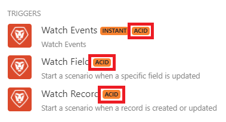

# 场景执行、周期和阶段

每个场景执行从初始化阶段开始，以至少一个由操作和提交/回滚阶段组成的周期继续，并且以最终化阶段结束

* 初始化
* 循环#1
   * 操作（读取或写入）
   * 提交或回滚
* 循环#2
   * 操作（读取或写入）
   * 提交或回滚
* ...
* 循环#n
   * 操作（读取或写入）
   * 提交或回滚
* 最终完成

在较小规模中，每个模块也遵循这些阶段。 有关模块阶段的信息可在已处理的捆绑包信息中找到，可在场景运行后在每个模块右上角的编号气泡中找到。 有关查找已处理捆绑包信息的详细信息，请参阅方案执行流文章中有关已处理捆绑包的[信息](/help/workfront-fusion/references/scenarios/scenario-execution-flow.md#information-about-processed-bundles)。

有关较大的场景阶段的信息，请参阅执行详细信息。

## 场景执行阶段

### 初始化

在初始化阶段，创建并检查所有必要的连接（与数据库、电子邮件服务等的连接），以确保模块能够执行预期操作。

### 周期

每个循环代表一个不可分割的工作单元，该工作单元由一系列操作组成，每个操作都带有提交或回滚。

您可以在[!UICONTROL 方案设置]面板中设置最大循环数。 默认数字为1。

* [操作](#operation)
* [提交](#commit)
* [回滚](#rollback)

#### 操作

在操作阶段，执行读取或写入操作：

* 读取操作包括从服务获取数据，然后由其它模块根据预定方案处理该数据。 例如，[!UICONTROL Workfront] >[!UICONTROL 监视记录]模块返回自上次方案执行以来创建的新包（记录）。
* 写入操作包括向给定服务发送数据以供进一步处理。 例如，Workfront >[!UICONTROL 上传Document]模块会将文件上传到Workfront。

#### 提交

如果操作阶段成功，则提交阶段开始，在此期间将提交模块执行的所有操作。 这意味着Workfront Fusion会向参与操作阶段的所有服务发送有关其成功的信息。

### 回滚

如果在任何模块的操作或提交阶段发生错误，该阶段将中止，并且回滚阶段将启动，从而使给定周期内的所有操作都无效。

>[!IMPORTANT]
>
>所有支持回滚（也称为事务性）的Workfront Fusion模块都标有ACID标记。
>
>
>
>当其他模块发生错误时，未使用此标记标记的模块无法恢复为初始状态。 非ACID模块的典型示例是[!UICONTROL 电子邮件] >[!UICONTROL 发送电子邮件]操作。 发送电子邮件后，无法撤消发送。

### 最终完成

在最终确定阶段，将关闭打开的连接（例如FTP连接、数据库连接等）并完成场景。

## 资源

有关详细信息，请参阅[配置方案设置](/help/workfront-fusion/create-scenarios/config-scenarios-settings/configure-scenario-settings.md)。
